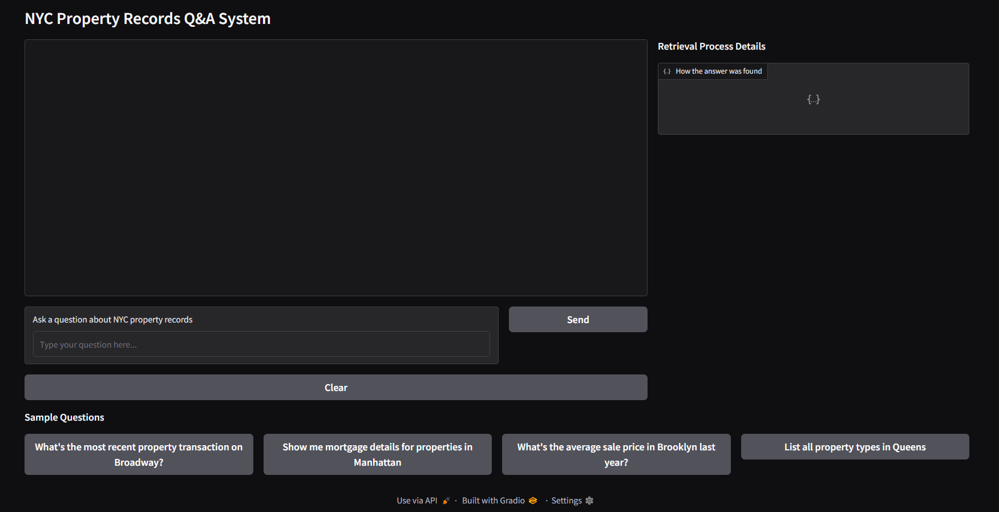
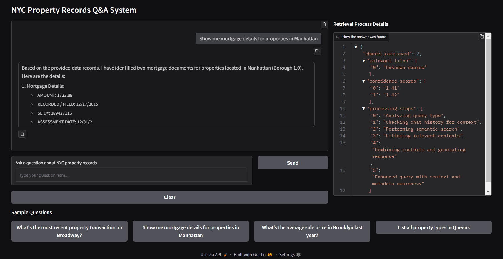

# **Project Documentation for NYC Property Query System**

This project utilizes a **Retrieval-Augmented Generation (RAG)** pipeline to process and query NYC property records. The system allows users to upload documents, retrieve relevant information using semantic search, and generate answers through a language model. Below is an overview of the components, setup instructions, and functionality of the system.



---

## **1. Setup Instructions**

### 1.1 **Environment Configuration**

Before you run the project, ensure the environment variables are properly set in a `.env` file. Here's an example:

```env
VECTOR_STORE="./chroma_db"
DATA_DIR = "data/NYCDB-ACRIS/"
METADATA_DIR = "data/metadata/"
FILE_PATH="./uploaded_docs"
JSON_PATH="./qa_history.json"
EMBED_MODEL="all-MiniLM-L6-v2"
MODEL="mixtral-8x7b-32768"
GROQ_API_KEY='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'
```

### 1.2 **Setting up the Database (`setupDB.py`)**

This script initializes the vector database and ingests CSV documents along with metadata into the system.

#### Steps:

1. **Initialization Check**: It verifies if the database is already initialized. If not, it proceeds to ingest the data.
2. **CSV & Metadata Files**: Reads CSV and metadata files from the specified directories (`DATA_DIR` and `METADATA_DIR`).
3. **Ingestion Process**: Uses `DocumentIngestor` to process the documents and ingest them into the ChromaDB collection.
4. **Flag File**: After successful ingestion, a flag file (`db_initialized.flag`) is created to indicate that the database is initialized.

To run the script:

```bash
python setupDB.py
```

---

## **2. Database Initialization (`initialiseDB.py`)**

This script is responsible for setting up the **ChromaDB** vector store and managing embeddings for semantic search.

### Key Features:

- **Persistent Client**: Ensures a ChromaDB collection is created or retrieved and is reusable across multiple sessions.
- **Embedding Model**: Utilizes the `all-MiniLM-L6-v2` embedding model for efficient text-to-vector conversion.

### Main Functionality:

- **initialize_vectorDB**: Creates or retrieves the ChromaDB collection, `documents_collection`.
- **Embedding Function**: Uses SentenceTransformer for embedding document text for future retrieval.

---

## **3. Document Processing (`preprocessing.py`)**

This script processes CSV files with metadata and prepares them for ingestion into the database.

### Key Features:

- **Column Normalization**: Standardizes column names to avoid discrepancies.
- **Chunking**: Breaks large documents into smaller chunks for better search performance.

### Methods:

- **normalize_column_name**: Removes spaces and special characters from column names.
- **create_column_mapping**: Maps CSV columns to corresponding metadata columns.
- **read_csv_with_metadata**: Reads CSV content and combines it with metadata for processing.
- **chunking**: Divides documents into smaller, manageable chunks based on the `CHUNK_SIZE`.

---

## **4. Document Ingestion (`ingestion.py`)**

This script manages the ingestion of processed documents into the ChromaDB collection.

### Key Features:

- **CSV Ingestion**: Reads and ingests CSV documents into ChromaDB, with chunking to optimize retrieval.
- **Batch Processing**: Handles document insertion in batches for efficiency.

### Methods:

- **process_csv_with_metadata**: Processes each CSV file along with its metadata, generates document chunks.
- **insert_documents_into_collection**: Inserts document chunks into ChromaDB in batches.
- **ingest_documents**: Orchestrates the full ingestion process from CSV to database.

---

## **5. Usage Flow**

### 5.1 **Setup Database**

To initialize the vector database and ingest documents:

```bash
python setupDB.py
```

This will process the CSV files and metadata, storing them in the ChromaDB vector store.

### 5.2 **Run the Application**

Once the database is initialized, launch the main application:

```bash
python main.py
```

This command starts the Gradio interface, where users can interact with the system by uploading CSV documents and asking questions.

### 5.3 **Querying the Database**

After uploading documents, users can ask questions like:

- "Who owns this address?"
- "What permits are required for renovations at this property?"

The system performs semantic search on the vector database and generates human-readable answers based on the retrieved documents.

---

## **6. RAG System Components**

### 6.1 **Main Application (`main.py`)**

- **DocumentQASystem**: Initializes and manages the Gradio UI, handling user queries and the retrieval process.
- **Process Query**: Handles queries and returns results, including metadata about the retrieval process (e.g., number of chunks retrieved, confidence scores).

### 6.2 **RAG Processing (`rag.py`)**

The core processing logic for semantic search and query response generation is handled by **RAGProcessor**.

- **semantic_search**: Conducts semantic searches on the vector database (ChromaDB).
- **get_context**: Formats the retrieved documents into context for response generation.
- **save_qa_to_json**: Stores question-answer pairs in a JSON file for future reference.
- **rag_query_with_explanation**: Main method orchestrating semantic search, context retrieval, query enhancement, and response generation.

### 6.3 **LLM Response Generation (`llm.py`)**

**LLMProcessor** interacts with the Groq API to generate responses from a language model (LLM).

- **generate_response**: Combines the user's query and context to generate detailed answers using the LLM.

### 6.4 **Prompts (`prompts.py`)**

Prompts define the structure for the model to ensure consistent, relevant answers.

- **SYSTEM_PROMPT** and **CHAT_PROMPT** are used to guide the model in generating answers about property-related queries.

---

## **7. Client Management (`clients.py`)**

**ClientManager** is a singleton class for managing connections to external services like Groq and the vector database.

- **Singleton Pattern**: Ensures only one instance of the client manager is used across the system.
- **Environment Variables**: Loads configuration for the vector store, embedding model, LLM model, and other essential paths from a `.env` file.

---

## **8. Configuration (`config.py`)**

This file defines constants used throughout the system for controlling the RAG pipeline and adjusting system behavior.

- **CHUNK_SIZE**: Maximum chunk size for document processing.
- **BATCH_SIZE**: Number of documents processed in each batch.
- **TEMPERATURE** and **TOP_P**: Control the randomness of the model’s output.
- **N_CHUNKS**: Number of similar chunks retrieved during semantic search.
- **CONFIDENCE_THRESHOLD**: Filters results based on similarity scores.



---

## **9. Additional Considerations**

### 9.1 **Metadata Handling**

- Each CSV file in the system is accompanied by metadata that is retrieved from the internet and ingested along with the CSV content. This metadata is stored in **ChromaDB** to enhance the search and retrieval process.

### 9.2 **Vector Database Selection**

- **ChromaDB** was selected for this project due to its capabilities in storing and querying vector embeddings. However, for broader accessibility and easier cloud integration, alternative vector databases like **Weaviate** or **Pinecone** would be more appropriate. These services provide cloud-based solutions that make it easier for others to check and query the vector database.

### 9.3 **Chunking and Retrieval Optimization**

- Although no special chunking or retrieval alterations have been applied in this system, there is significant potential for improvement. More advanced techniques like **reranking** could be applied to enhance the relevance of the retrieved chunks. Using **chunking strategies** tailored to the dataset can further improve the performance and accuracy of search results.

### 9.4 **Frameworks and Libraries**

- Currently, the project is developed entirely from scratch. However, frameworks like **Langchain** or **LlamaIndex** could have been used to streamline development. These libraries offer quick integrations for building pipelines and managing connections to vector databases.

### 9.5 **Prompt Engineering**

- The prompts used in the system are kept simple but could be further enhanced. Techniques like **CoT (Chain of Thought)** and **special role assignments** could be employed for more structured and precise answers, ensuring better response quality.

### 9.6 **Optimization and UI Enhancements**

- Future work could focus on reducing latency in the chatbot UI by leveraging frameworks like **Chainlit** or **Streamlit**. These frameworks can improve both the responsiveness of the application and the user experience by enabling smoother interactions.

### 9.7 **Docker Integration**

- **Docker Integration**: Although Docker integration could be beneficial for containerizing the application and simplifying deployment, it has not been implemented in this project. The reason for this is the current system's inability to efficiently handle large-scale applications in a Dockerized environment. The system tends to slow down or hang during Docker startup, likely due to resource limitations. Once the system can handle larger applications more reliably, Docker integration could be revisited.
